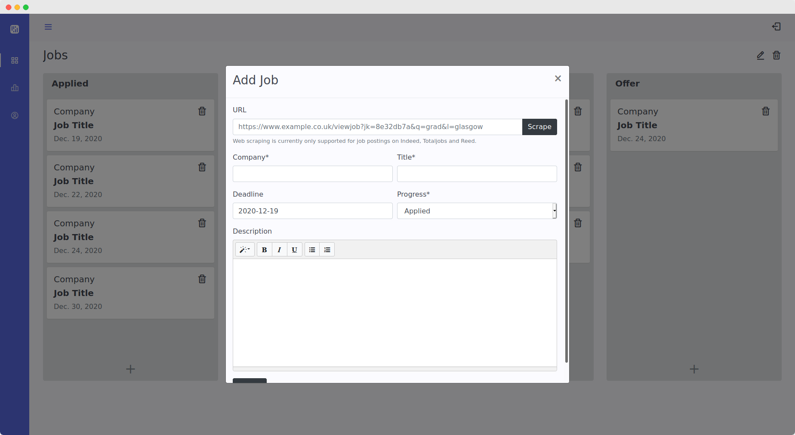

[](http://www.djangoproject.com/)

👉 [View Live](https://job-tracker.zainuddinsiddiqi.com) 

<h1 align="center">Job Tracker</h1>
 
### Screenshots 📸




### Tools Used 🛠

- Django web framework
- Bootstrap
- PostgreSQL
- Docker

### Setup Locally ⚙️

1. [Clone the repository locally.](https://docs.github.com/en/free-pro-team@latest/github/creating-cloning-and-archiving-repositories/cloning-a-repository)

2. Set up all necessary dependencies:
   ```sh
   python -m venv .venv
   
   source .venv/bin/activate
   
   # Windows users
   # source .venv/scripts/activate

   pip install -r requirements.txt
   ```
   
3. Set environment variables:
   ```sh
   export 'DJANGO_SECRET_KEY=secret'
   ```
  
4. Apply all migrations:
   ```sh
   python manage.py migrate
   ```
   
5. Deploy web app on localhost:
   ```sh
   python manage.py runserver
   ```